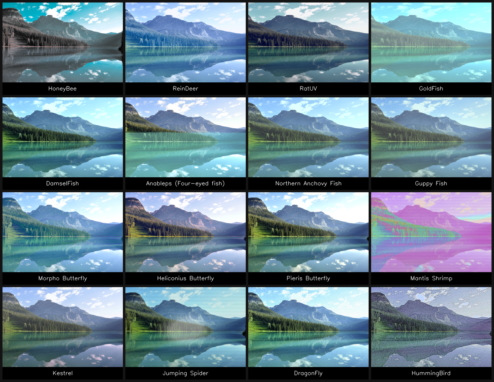

# Animal Vision
A tool to help people visualize how animals see, using a combination of machine learning & mathematical models.

Our motivation is that this allow us humans to truly appreciate the biodiversity of the nature, and feel the need to conserve this beautiful ecosystem of our planet Earth.

https://github.com/user-attachments/assets/3c1bec96-1103-4557-8050-9309c2cb3706

# Visualization
## Non-UV Animals
We rendered the eyes of these animals using mathematical transformation to map 


## UV Animals
We convert the RGB (3 wavelengths) into Hyperspectral Images (31 wavelengths).
This allow us to leverage spectral local similarity to estimate UV values.
We then map these UV values into different receptors and render the reflectance values.



These are unique animals which have interesting visualization from UV.


# Feaures

## Data Preparation
Here are the steps to prepare `input` and `output`.
1. Make and `input/images` folder in root dir.
2. Make and `input/video` folder in root dir.
3. Make and `output` folder in root dir.

Add required input in their respective folders.

> When prompt for filename to save as, you DO NOT need to put extension.
```bash
save            # True
save.png        # False as it will result in save.png.png
```

## Commands
### Visualizing from a static image
```bash
python -m main image
```

### Visualizing from a static video
```bash
python -m main video
```

### Visualizing from a webcam
```bash
python -m main webcam
```

## Project Structure

```
📂 project-root/
├── 📂 animals/                  # Animal-specific vision simulation modules
│   ├── animal.py                # Base Animal class (shared interface/logic)
│   ├── cat.py                   # Cat vision model
│   └── dog.py                   # Dog vision model
│
├── 📂 renderers/                # Rendering backends for I/O and visualization
│   ├── renderer.py              # Base Renderer class
│   ├── image.py                 # ImageRenderer: load/show/save still images
│   ├── video.py                 # VideoRenderer: process video streams
│   └── webcam.py                # WebcamRenderer: live camera capture/preview
│
├── main.py                      # CLI entry point (Typer/Inquirer-based)
├── utils.py                     # Helper utilities (e.g., Inquirer menus)
│
└── README.md                    # Project documentation (this file)
```


